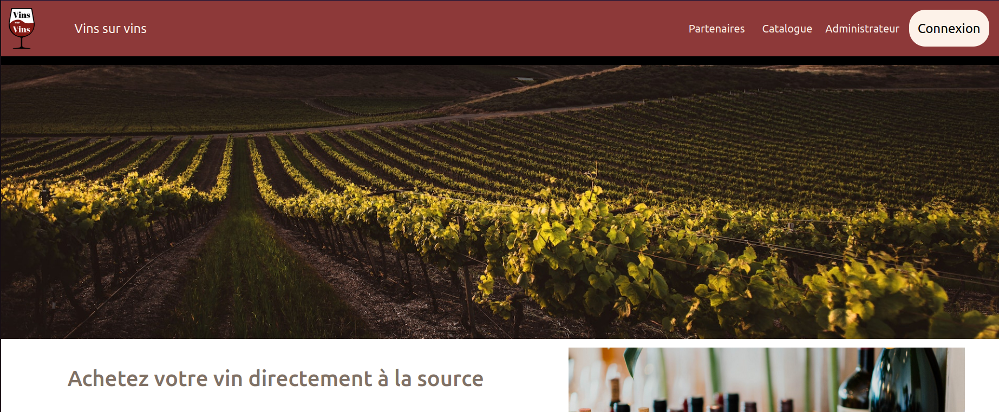
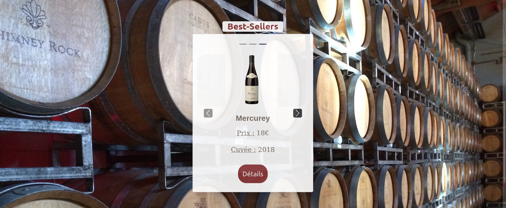
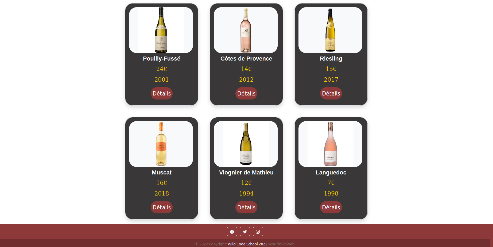

# Vin sur Vin

## Description

Nous sommes Mathieu, Lila, Jesse et Damien ! Quatre étudiants à la Wild Code School de Lyon, spécialisés en cursus PHP.

Ce site est notre deuxième projet au sein de la formation !
Nous l'avons réalisé en équipe et en cinq semaines en ayant certaines contraintes de technologie (Simple MVC, Twig, Composer)
ainsi que des contraintes de méthodes (Méthode Agile)

Ce site a pour vocation de permettre à de petits exploitants viticoles d'avoir de la visibilité sur internet.

---

We are Mathieu, Lila, Jesse and Damien ! Four students at the Wild Code School of Lyon, specialized in PHP course.

This website is our second project within the formation !
We did it as a team and in five weeks with certain technology constraints (Simple MVC, Twig, Composer)
as well as method constraints (Agile Method)

The purpose of this site is to allow small winegrowers to have visibility on the internet.

## Etapes d'installation / Installation steps

1. Cloner le repo depuis Github.
2. Lancer `composer install`.
3. Créer _config/db.php_ depuis le fichier _config/db.php.dist_ et ajouter vos paramètres de BD.

```php
definir('APP_DB_USER', 'your_db_user_wich_is_not_root');
definir('APP_DB_PASSWORD', 'your_db_password');
definir('APP_DB_HOST', 'your_db_host');
definir('APP_DB_NAME', 'vin_sur_vin');
```

4. Importer _database.sql_ dans votre serveur SQL, vous pouvez le faire manuellement ou utiliser le script _migration.php_ qui va importer le fichier _database.sql_.
5. Lancer le webserveur PHP interne avec `php -S localhost:8000 -t public/`.
6. Allez sur `localhost:8000` avec votre navigateur préféré.

---

1. Clone the repo from Github.
2. Run `composer install`.
3. Create _config/db.php_ from _config/db.php.dist_ file and add your DB parameters.

```php
define('APP_DB_USER', 'your_db_user_wich_is_not_root');
define('APP_DB_PASSWORD', 'your_db_password');
define('APP_DB_HOST', 'your_db_host');
define('APP_DB_NAME', 'vin_sur_vin');
```

4. Import _database.sql_ in your SQL server, you can do it manually or use the _migration.php_ script which will import a _database.sql_ file.
5. Run the internal PHP webserver with `php -S localhost:8000 -t public/`.
6. Go to `localhost:8000` with your favorite browser.

## Langage utilisé / Language used

-   HTML, CSS (Bootstrap)
-   PHP, MySQL (avec tables relationnelles)
-   Twig, Composer
-   Simple MVC

## Visuel du site / Website visual




